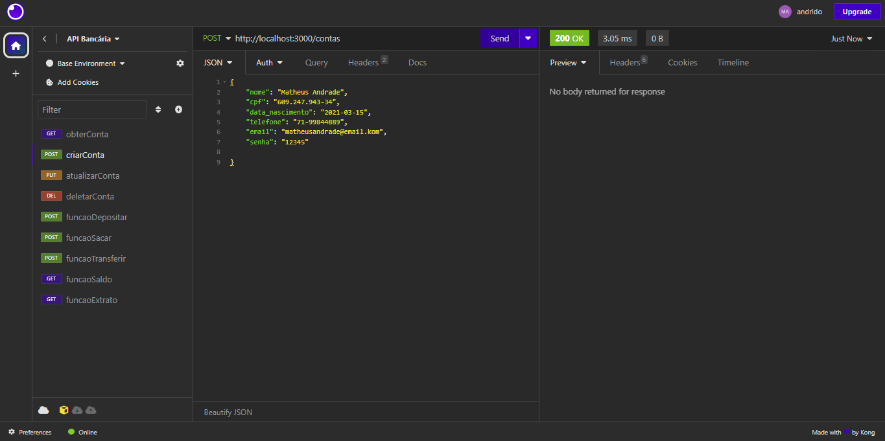

# API Bancária

## Funcionalidades Principais

### Criar Conta

- **Endpoint**: `POST /contas`
- **Descrição**: Este endpoint permite criar uma nova conta bancária. Uma conta é criada com um número único e informações do titular.
- **Exemplo de Solicitação**: 

### Atualizar Conta

- **Endpoint**: `PUT /contas/:numeroConta/usuario`
- **Descrição**: Este endpoint permite atualizar as informações de uma conta bancária existente.
- **Exemplo de Solicitação (print)**:

### Depósito

- **Endpoint**: `POST /transacoes/depositar`
- **Descrição**: Este endpoint permite realizar um depósito em uma conta bancária.
- **Exemplo de Solicitação (print)**:

### Saque

- **Endpoint**: `POST /transacoes/sacar`
- **Descrição**: Este endpoint permite realizar um saque de uma conta bancária.
- **Exemplo de Solicitação (print)**:

### Transferência

- **Endpoint**: `POST /transacoes/transferir`
- **Descrição**: Este endpoint permite realizar uma transferência entre contas bancárias.
- **Exemplo de Solicitação (print)**:

### Saldo

- **Endpoint**: `GET /contas/saldo`
- **Descrição**: Este endpoint permite consultar o saldo de uma conta bancária.
- **Exemplo de Solicitação (print)**: `GET /contas/saldo?numero_conta=1&senha=senhadatitular`

### Extrato

- **Endpoint**: `GET /contas/extrato`
- **Descrição**: Este endpoint permite listar as transações realizadas em uma conta bancária.
- **Exemplo de Solicitação (print)**: `GET /contas/extrato?numero_conta=1&senha=senhadatitular`

### Obter Contas

- **Endpoint**: `GET /contas`
- **Descrição**: Este endpoint permite listar todas as contas bancárias existentes. Para acessar a lista de contas, você deve fornecer a senha do banco.
- **Exemplo de Solicitação (print)**:

## Como Executar o Projeto

Siga estas etapas para executar o projeto em seu ambiente local:

1. **Clonar o Repositório**:
 Clone este repositório em sua máquina local.

2. **Instalar Dependências**:
 Navegue até o diretório do projeto e instale as dependências com `npm install`.

3. **Executar o Servidor**:
 Inicie o servidor com `npm start`.

4. **Acessar a API**:
 A API estará acessível em `http://localhost:3000`. Use ferramentas como [Insomnia](https://insomnia.rest/) para fazer solicitações à API.
